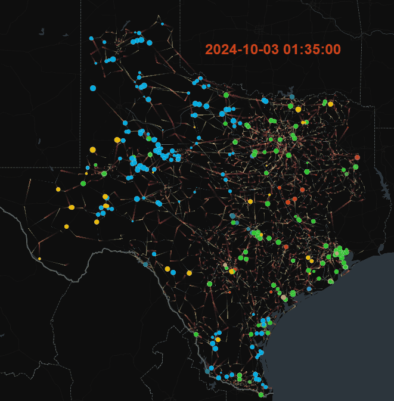
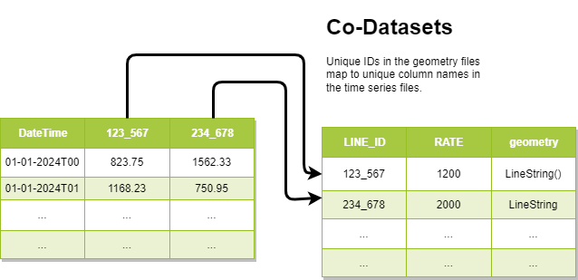

# GridSight
## An interactive web tool for dynamically visualizing grid related data.

> [!CAUTION]
> This software is experimental and subject to change.

## **Key Features**
1. Visually animate and play through each timestep.
2. Dynamically filter both generators and transmission lines.
3. Web apis to upload new PCM scenarios as part of your modeling pipeline.

## Data Format (General)

The animation engine loops through rows in the timeseries data and maps them to transmission or generator geometries.

Follow the instructions [here](docs/tutorials/self-service.MD) for uploading new scenarios to GridSight.

## Development and Testing Setup

To set up you will need **python3** and **node** installed locally.

Run `docker-compose build` and `docker-compose up`

Install the gridsight client into your virtual environment.

`pip install .` or `pip install git+https://www.github.com/NREL/GridSight`

To upload the demonstration data run `python upload_test_data.py`

After uploading data, log in and adjust the layer styles to scale up the generation and
transmission radius/width.

## Roadmap

1. Generalization of animated layers to allow any type of geometry+timeseries
2. Allow Custom Color maps.
3. Multi-Scenario animation and comparison.
4. Drilldown capabilities into individual generators/lines and geographic areas (aggregate generation or transmission).

## Additional Notes
This software was developed as part of the National Transmission Planning study.

NREL software record: SWR-24-16

Geometry data was sourced from the Texas2k Series24 datasets. Timeseries data is completely fictional.
<https://electricgrids.engr.tamu.edu/activsg2000-dynamics-cases-2024/>
